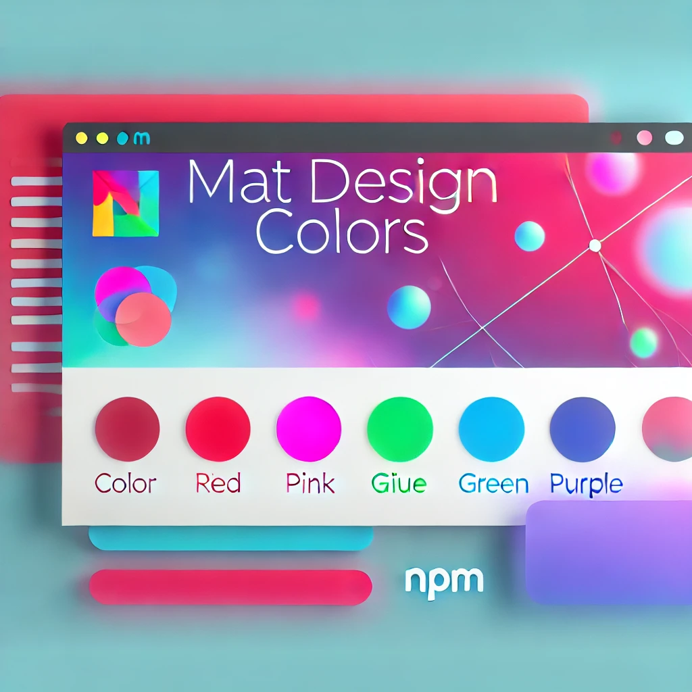

# Mat Design Colors



A comprehensive Material Design color palette library for JavaScript and TypeScript with intuitive API, powerful color utilities, and CSS generation capabilities.

[](https://www.npmjs.com/package/mat-design-colors)
[](https://www.typescriptlang.org/)
[](LICENSE)

🎨 **[Live Demo & Documentation](https://sitharaj88.github.io/mat-design-colors)**

## ✨ What's New in v2.0

- 🎨 **Color Utilities** - Convert, lighten, darken, mix colors and more
- 🔍 **Helper Functions** - Search colors, generate CSS variables, get palettes
- 📝 **Better TypeScript Support** - Comprehensive JSDoc documentation
- 🎯 **CSS Generation** - Generate CSS custom properties and utility classes
- ⚡ **Improved Performance** - Optimized color calculations

---

## Table of Contents

- [Installation](#installation)
- [Quick Start](#quick-start)
- [Color Palette](#color-palette)
- [Color Utilities](#color-utilities)
- [Helper Functions](#helper-functions)
- [CSS Generation](#css-generation)
- [API Reference](#api-reference)
- [Examples](#examples)
- [Contributing](#contributing)
- [License](#license)

---

## Installation

```bash
npm install mat-design-colors
```

or using yarn:

```bash
yarn add mat-design-colors
```

---

## Quick Start

```typescript
import { MaterialColor, ColorShade } from 'mat-design-colors';

// Access any Material Design color
const red500 = MaterialColor.RED[ColorShade.S500];
console.log(red500); // "#F44336"

// Access accent shades
const pinkA200 = MaterialColor.PINK[ColorShade.SA200];
console.log(pinkA200); // "#FF4081"
```

---

## Color Palette

### Available Colors

| Color | Primary (500) | Color | Primary (500) |
|-------|---------------|-------|---------------|
| RED | `#F44336` | LIGHT_GREEN | `#8BC34A` |
| PINK | `#E91E63` | LIME | `#CDDC39` |
| PURPLE | `#9C27B0` | YELLOW | `#FFEB3B` |
| DEEP_PURPLE | `#673AB7` | AMBER | `#FFC107` |
| INDIGO | `#3F51B5` | ORANGE | `#FF9800` |
| BLUE | `#2196F3` | DEEP_ORANGE | `#FF5722` |
| LIGHT_BLUE | `#03A9F4` | BROWN | `#795548` |
| CYAN | `#00BCD4` | GREY | `#9E9E9E` |
| TEAL | `#009688` | BLUE_GREY | `#607D8B` |
| GREEN | `#4CAF50` | | |

### Available Shades

| Standard Shades | Accent Shades |
|----------------|---------------|
| S50, S100, S200, S300, S400 | SA100, SA200, SA400, SA700 |
| S500, S600, S700, S800, S900 | |

> **Note:** Brown, Grey, and Blue Grey don't have accent shades.

---

## Color Utilities

The library provides powerful functions for color manipulation and conversion.

### Color Conversion

```typescript
import { hexToRgb, rgbToHex, hexToHsl, hslToHex } from 'mat-design-colors';

// Hex to RGB
const rgb = hexToRgb('#F44336');
console.log(rgb); // { r: 244, g: 67, b: 54 }

// RGB to Hex
const hex = rgbToHex(244, 67, 54);
console.log(hex); // "#F44336"

// Hex to HSL
const hsl = hexToHsl('#F44336');
console.log(hsl); // { h: 4, s: 90, l: 58 }

// HSL to Hex
const hexFromHsl = hslToHex(4, 90, 58);
console.log(hexFromHsl); // "#F44336"
```

### Color Manipulation

```typescript
import { lighten, darken, alpha, mix } from 'mat-design-colors';

// Lighten a color by 20%
const lighter = lighten('#F44336', 20);

// Darken a color by 20%
const darker = darken('#F44336', 20);

// Add transparency
const transparent = alpha('#F44336', 0.5);
console.log(transparent); // "rgba(244, 67, 54, 0.5)"

// Mix two colors
const mixed = mix('#FF0000', '#0000FF', 0.5);
```

### Color Analysis

```typescript
import { 
  isLight, 
  isDark, 
  getContrastColor,
  getContrastRatio,
  getLuminance 
} from 'mat-design-colors';

// Check if a color is light or dark
console.log(isLight('#FFFFFF')); // true
console.log(isDark('#000000'));  // true

// Get best contrast color (black or white)
const textColor = getContrastColor('#F44336');
console.log(textColor); // "#FFFFFF"

// Calculate contrast ratio (WCAG)
const ratio = getContrastRatio('#FFFFFF', '#000000');
console.log(ratio); // 21

// Get luminance value
const luminance = getLuminance('#F44336');
```

### Additional Utilities

```typescript
import { 
  invert, 
  grayscale, 
  saturate, 
  desaturate, 
  adjustHue,
  complement 
} from 'mat-design-colors';

// Invert a color
const inverted = invert('#FF0000'); // "#00FFFF"

// Convert to grayscale
const gray = grayscale('#F44336');

// Adjust saturation
const moreSaturated = saturate('#F44336', 20);
const lessSaturated = desaturate('#F44336', 20);

// Rotate hue
const rotated = adjustHue('#F44336', 90);

// Get complementary color
const complementary = complement('#F44336');
```

---

## Helper Functions

### Working with Palettes

```typescript
import { 
  getAllColors, 
  getAllShades, 
  getColor, 
  getColorPalette,
  getPrimaryShade,
  getColorWithContrast 
} from 'mat-design-colors';

// Get all color names
const colors = getAllColors();
console.log(colors); // ['RED', 'PINK', 'PURPLE', ...]

// Get all shade names
const shades = getAllShades();
console.log(shades); // ['S50', 'S100', ..., 'SA700']

// Get a color by string name
const blue500 = getColor('BLUE', 'S500');
console.log(blue500); // "#2196F3"

// Get all shades for a color
const redPalette = getColorPalette('RED');
console.log(redPalette.S500); // "#F44336"

// Get primary (500) shade
const primary = getPrimaryShade('INDIGO');
console.log(primary); // "#3F51B5"

// Get color with contrast text
const withContrast = getColorWithContrast('YELLOW', 'S200');
console.log(withContrast);
// { background: "#FFF59D", text: "#000000" }
```

### Searching Colors

```typescript
import { searchColors, findColorByHex } from 'mat-design-colors';

// Search colors by name
const blueColors = searchColors('blue');
console.log(blueColors);
// [{ colorName: 'BLUE', shade: 'S50', hex: '#E3F2FD' }, ...]

// Find color info by hex value
const colorInfo = findColorByHex('#F44336');
console.log(colorInfo);
// { colorName: 'RED', shade: 'S500', hex: '#F44336' }
```

### Random Color

```typescript
import { getRandomColor, getColorsByCategory } from 'mat-design-colors';

// Get a random Material Design color
const random = getRandomColor();
console.log(random);
// { colorName: 'TEAL', shade: 'S400', hex: '#26A69A' }

// Get colors grouped by category
const categories = getColorsByCategory();
console.log(categories);
// {
//   reds: ['RED', 'PINK'],
//   purples: ['PURPLE', 'DEEP_PURPLE'],
//   blues: ['INDIGO', 'BLUE', 'LIGHT_BLUE', 'CYAN'],
//   greens: ['TEAL', 'GREEN', 'LIGHT_GREEN', 'LIME'],
//   yellows: ['YELLOW', 'AMBER', 'ORANGE', 'DEEP_ORANGE'],
//   neutrals: ['BROWN', 'GREY', 'BLUE_GREY']
// }
```

---

## CSS Generation

Generate CSS custom properties or utility classes for use in your stylesheets.

### CSS Custom Properties

```typescript
import { generateCSSVariables } from 'mat-design-colors';

const css = generateCSSVariables();
console.log(css);
// :root {
//   --md-red-50: #FFEBEE;
//   --md-red-100: #FFCDD2;
//   ...
// }

// With custom prefix
const customCss = generateCSSVariables('material');
// :root {
//   --material-red-50: #FFEBEE;
//   ...
// }
```

### CSS Utility Classes

```typescript
import { generateCSSClasses } from 'mat-design-colors';

// Background color classes
const bgClasses = generateCSSClasses('bg', 'background-color');
console.log(bgClasses);
// .bg-red-50 { background-color: #FFEBEE; }
// .bg-red-100 { background-color: #FFCDD2; }
// ...

// Text color classes
const textClasses = generateCSSClasses('text', 'color');
// .text-red-50 { color: #FFEBEE; }
// ...
```

---

## API Reference

### Core Exports

| Export | Description |
|--------|-------------|
| `MaterialColor` | Object containing all color palettes |
| `ColorShade` | Enum of all available shade values |

### Color Utilities

| Function | Description |
|----------|-------------|
| `hexToRgb(hex)` | Convert hex to RGB object |
| `rgbToHex(r, g, b)` | Convert RGB to hex string |
| `hexToHsl(hex)` | Convert hex to HSL object |
| `hslToHex(h, s, l)` | Convert HSL to hex string |
| `lighten(hex, amount)` | Lighten a color |
| `darken(hex, amount)` | Darken a color |
| `alpha(hex, opacity)` | Add alpha channel |
| `mix(hex1, hex2, weight)` | Mix two colors |
| `invert(hex)` | Invert a color |
| `grayscale(hex)` | Convert to grayscale |
| `saturate(hex, amount)` | Increase saturation |
| `desaturate(hex, amount)` | Decrease saturation |
| `adjustHue(hex, degrees)` | Rotate hue |
| `complement(hex)` | Get complementary color |
| `isLight(hex)` | Check if color is light |
| `isDark(hex)` | Check if color is dark |
| `getContrastColor(hex)` | Get best contrast color |
| `getContrastRatio(hex1, hex2)` | Calculate contrast ratio |
| `getLuminance(hex)` | Get relative luminance |

### Helper Functions

| Function | Description |
|----------|-------------|
| `getAllColors()` | Get all color names |
| `getAllShades()` | Get all shade values |
| `getColor(name, shade)` | Get color by string values |
| `getColorPalette(name)` | Get all shades for a color |
| `getPrimaryShade(name)` | Get S500 shade |
| `getColorWithContrast(name, shade)` | Get color with text contrast |
| `searchColors(query)` | Search colors by name |
| `findColorByHex(hex)` | Find color info by hex |
| `getRandomColor()` | Get random color |
| `getColorsByCategory()` | Get colors grouped by hue |
| `generateCSSVariables(prefix)` | Generate CSS custom properties |
| `generateCSSClasses(prefix, property)` | Generate CSS utility classes |

### Types

```typescript
interface RGB { r: number; g: number; b: number; }
interface HSL { h: number; s: number; l: number; }
interface RGBA extends RGB { a: number; }
type ColorName = keyof typeof MaterialColor;
interface ColorSearchResult { colorName: ColorName; shade: ColorShade; hex: string; }
```

---

## Examples

### React Component with Dynamic Theming

```tsx
import React from 'react';
import { MaterialColor, ColorShade, getContrastColor } from 'mat-design-colors';

function ColorButton({ color, shade }: { color: keyof typeof MaterialColor; shade: ColorShade }) {
  const bgColor = MaterialColor[color][shade];
  const textColor = getContrastColor(bgColor);
  
  return (
    <button style={{ backgroundColor: bgColor, color: textColor }}>
      {color} {shade}
    </button>
  );
}
```

### CSS-in-JS with Generated Variables

```typescript
import { generateCSSVariables } from 'mat-design-colors';

// Inject CSS variables into your document
const styleTag = document.createElement('style');
styleTag.textContent = generateCSSVariables();
document.head.appendChild(styleTag);

// Now use in your CSS
// color: var(--md-red-500);
```

---

## Contributing

Contributions are welcome! Please feel free to submit a Pull Request.

1. Fork the repository
2. Create your feature branch (`git checkout -b feature/amazing-feature`)
3. Commit your changes (`git commit -m 'Add amazing feature'`)
4. Push to the branch (`git push origin feature/amazing-feature`)
5. Open a Pull Request

---

## License

This project is licensed under the Apache License 2.0 - see the [LICENSE](LICENSE) file for details.

---

## Author

**Sitharaj Seenivasan**

- GitHub: [@sitharaj88](https://github.com/sitharaj88)

---

Made with ❤️ for the developer community
